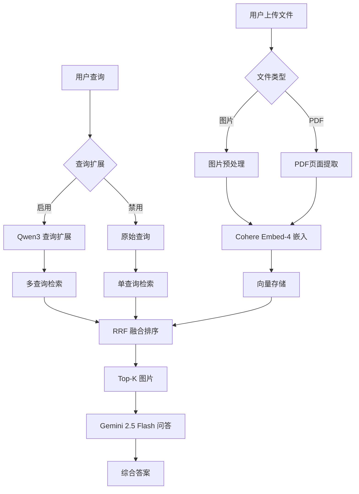

# Vision RAG 🖼️

一个基于多模态嵌入的视觉检索增强生成系统，支持图片和PDF文档的智能问答。

## ✨ 特性

- 🔍 **多模态检索**：使用 Cohere Embed-4 进行图片和文本的联合嵌入
- 📄 **PDF 支持**：自动提取PDF页面并转换为可搜索的图片
- 🤖 **智能查询扩展**：基于 Qwen3-235B-A22B 的查询优化和多变体生成
- 🔄 **RRF 融合算法**：采用 Reciprocal Rank Fusion 提升检索精度
- 💬 **多图片问答**：使用 Google Gemini 2.5 Flash 基于多张相关图片生成综合答案
- 🎯 **实时处理**：支持批量文件上传和实时嵌入计算
- 🎨 **直观界面**：基于 Streamlit 的用户友好界面

## 🏗️ 系统架构

### 核心组件

1. **嵌入生成器** (`compute_image_embedding`)
   - 使用 Cohere Embed-4 模型
   - 支持图片的高质量向量化表示
   - 自动图片尺寸优化（最大 1568×1568 像素）

2. **PDF 处理器** (`process_pdf_file`)
   - 基于 PyMuPDF 的页面提取
   - 150 DPI 高质量渲染
   - 批量页面嵌入生成

3. **查询扩展代理** (`QueryExpansionAgent`)
   - 智能生成 3-5 个英文查询变体
   - 语义多样化和同义词扩展
   - 针对视觉内容优化的查询重写

4. **多查询检索系统**
   - **单查询模式**：传统余弦相似度检索
   - **多查询融合模式**：RRF 算法融合多个查询结果
   - 可配置返回结果数量（1-10个）

5. **多模态问答引擎** (`answer_multiple`)
   - Google Gemini 2.5 Flash 驱动
   - 综合分析多张图片内容
   - 中文优化的回答生成

## 🚀 快速开始

### 环境要求

- Python 3.8+
- 所需依赖包（见 requirements.txt）

### 安装步骤

1. **克隆项目**
```bash
git clone <repository-url>
cd Vision_RAG
```

2. **安装依赖**
```bash
pip install -r requirements.txt
```

3. **获取 API 密钥**
   Qwen3密钥目前从ModelScope获取免费试用，需要替换utils/apis.py中的api key.
   - [Qwen3 API 密钥](https://www.modelscope.cn/models/Qwen/Qwen3-235B-A22B)
   - [Cohere API 密钥](https://dashboard.cohere.com/api-keys)
   - [Google API 密钥](https://aistudio.google.com/app/apikey)

4. **启动应用**
```bash
streamlit run vision_rag.py
```

### 使用流程

1. **配置 API 密钥**
   - 在侧边栏输入 Cohere 和 Google API 密钥

2. **上传文件**
   - 支持格式：PNG, JPG, JPEG, PDF
   - 可批量上传多个文件
   - PDF 自动按页面拆分处理

3. **配置检索参数**
   - 启用/禁用查询扩展
   - 设置返回结果数量（1-10）

4. **提问和获取答案**
   - 输入关于图片内容的问题
   - 系统自动检索相关图片
   - 生成基于多图片的综合答案

## 🔧 技术细节

### 工作流程



### 核心算法

#### 1. Reciprocal Rank Fusion (RRF)
```python
def reciprocal_rank_fusion(rankings, k=60):
    rrf_scores = defaultdict(float)
    for ranking in rankings:
        for rank, (doc_idx, _) in enumerate(ranking):
            rrf_scores[doc_idx] += 1.0 / (k + rank + 1)
    return sorted(rrf_scores.items(), key=lambda x: x[1], reverse=True)
```

#### 2. 余弦相似度检索
```python
cos_sim_scores = np.dot(query_emb, embeddings.T)
top_indices = np.argsort(cos_sim_scores)[::-1][:top_k]
```

### 模型配置

- **嵌入模型**：Cohere Embed-4 (多模态)
- **查询扩展**：Qwen3-235B-A22B
- **问答模型**：Google Gemini 2.5 Flash Preview
- **PDF 处理**：PyMuPDF (150 DPI)

## 📁 项目结构

```
Vision_RAG/
├── vision_rag.py           # 主应用程序
├── requirements.txt        # 依赖包列表
├── README.md              # 项目文档
├── agent/                 # 智能代理模块
│   ├── query_agent.py     # 查询扩展代理
│   └── answer_agent.py    # 答案生成代理
├── utils/                 # 工具模块
│   └── apis.py           # API 配置管理
├── pdf_pages/            # PDF 页面存储目录
└── uploaded_img/         # 上传图片存储目录
```

## ⚙️ 配置选项

### 侧边栏设置

- **API 密钥配置**
  - Cohere API 密钥（必需）
  - Google API 密钥（必需）

- **高级设置**
  - 查询扩展开关
  - 返回结果数量（1-10）

### 查询扩展配置

在 `agent/query_agent.py` 中可调整：
- 温度参数（creativity）
- 最大 token 数
- 查询变体数量

## 🎯 使用场景

- **学术研究**：论文图表分析和解释
- **技术文档**：架构图和流程图问答
- **教育培训**：图片内容的详细讲解
- **商业分析**：图表数据的智能解读
- **医疗影像**：医学图片的辅助分析

## 🔍 示例查询

- "给我讲解下transformer模型的结构"
- "这个架构图中的各个组件是如何连接的？"
- "图表中显示的数据趋势是什么？"
- "这个流程图的主要步骤有哪些？"
- "解释一下这个神经网络的工作原理"

## 🚨 注意事项

1. **API 密钥安全**：请妥善保管您的 API 密钥，不要在代码中硬编码
2. **文件大小限制**：大型 PDF 文件可能需要较长处理时间
3. **图片质量**：建议上传清晰、高质量的图片以获得更好的检索效果
4. **网络连接**：需要稳定的网络连接以访问 API 服务

## 🛠️ 故障排除

### 常见问题

1. **API 密钥错误**
   - 检查密钥是否正确输入
   - 确认密钥权限和配额

2. **文件上传失败**
   - 检查文件格式是否支持
   - 确认文件大小合理

3. **查询扩展失败**
   - 系统会自动回退到原始查询模式
   - 检查网络连接状态

4. **嵌入生成失败**
   - 检查图片文件是否损坏
   - 确认 Cohere API 服务状态

## 📈 性能优化

- **缓存机制**：图片嵌入结果自动缓存 1 小时
- **批量处理**：支持多文件并行处理
- **内存管理**：大图片自动压缩至合适尺寸
- **会话状态**：智能管理上传文件和嵌入向量

## 🤝 贡献指南

欢迎提交 Issue 和 Pull Request 来改进项目！

## 📄 许可证

本项目采用 MIT 许可证。

## 🙏 致谢

- [Cohere](https://cohere.com/) - 提供强大的多模态嵌入模型
- [Google](https://ai.google.dev/) - 提供 Gemini 多模态大语言模型
- [Streamlit](https://streamlit.io/) - 提供优秀的 Web 应用框架
- [PyMuPDF](https://pymupdf.readthedocs.io/) - 提供 PDF 处理能力